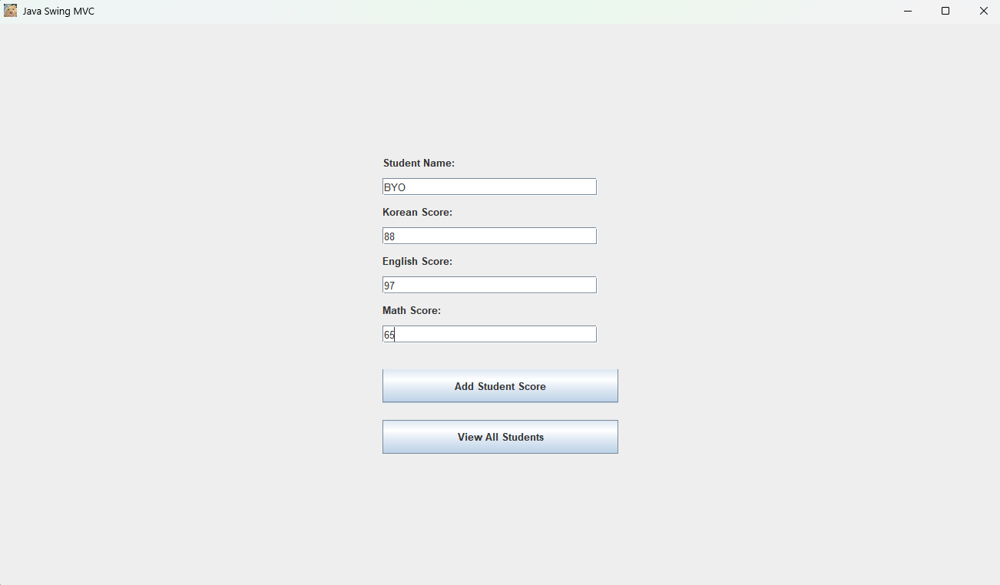
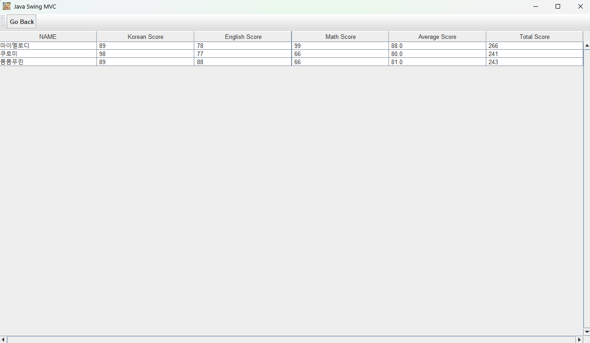

# 학생 성적 관리 프로그램 (Java Swing MVC)

Java Swing과 MVC 디자인 패턴을 기반으로 만든 간단한 학생 성적 관리 데스크탑 애플리케이션입니다.  
학생의 이름과 과목별 점수를 입력하고, 저장된 학생 목록을 확인할 수 있습니다.

---

### 🖥️ 기능 소개

- 학생 이름과 국어, 영어, 수학 점수 입력
- 학생 성적 데이터 파일 저장 (`database.txt`)
- 저장된 학생 목록 테이블로 보기
- 각 학생의 총점 및 평균 자동 계산
- MVC 아키텍처 기반 구조

---

### 🏗️ 프로젝트 구조
```
src/
├── Model/
│ ├── Student.java # 학생 데이터 모델
│ └── Database.java # 데이터 저장/로드 클래스
├── View/
│ ├── Form.java # 성적 입력 폼 (JPanel)
│ ├── StudentDetails.java # 저장된 학생 목록 출력 뷰 (JPanel)
│ └── MainFrame.java # 전체 프레임 (JFrame + CardLayout)
├── Controller/
│ └── StudentController.java # 사용자 입력 처리 및 흐름 제어
├── data/
│ └── database.txt # 성적 데이터 저장 파일
└── assets/
└── default.png # 애플리케이션 아이콘
```

---

### 🚀 실행 방법

1. IDE(IntelliJ, Eclipse 등)로 `App.java` 실행
2. 학생 성적을 입력 후 "Add Student Score" 클릭
3. "View All Students" 버튼을 눌러 등록된 학생 목록 확인

---

### 📌 예시 화면




---

### 💡 사용된 기술

- Java Swing (GUI)
- MVC 디자인 패턴
- 파일 입출력 (BufferedReader, BufferedWriter)
- JTable + JScrollPane UI 구성

---

### 🙌 개선 아이디어

- 유효성 검사 강화 (0점 허용, 숫자 체크 등)
- 점수 기준으로 정렬 기능 추가
- 성적 수정/삭제 기능 추가
- JSON 형식 저장 방식으로 확장
- 전체 학생 평균 및 통계 기능 추가

---

### 📁 데이터 예시
```
마이멜로디, 89, 78, 99, 88.0, 266
쿠로미, 98, 77, 66, 80.0, 241
폼폼푸린, 89, 88, 66, 81.0, 243
```


